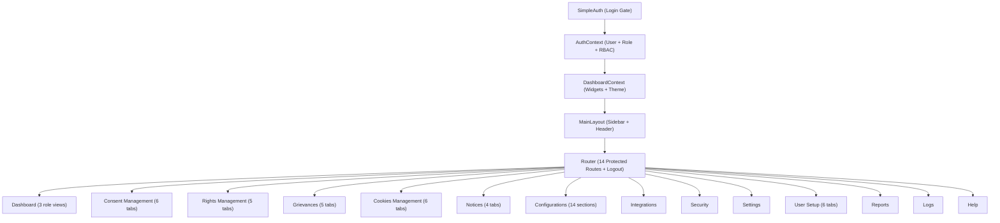

# CMS Frontend Architecture – Complete Flow & Backend Planning Guide (v2)

> **Re-verified version.** Every component file (128+ files) has been reviewed. All data models, inline interfaces, and mock data structures are captured below.

---

## Overview

A **Consent Management System** built with **React + TypeScript + Vite + Tailwind + shadcn/ui**. Manages data privacy consents, rights requests, grievances, cookie banners, privacy notices, and compliance across multiple regulations (DPDP, GDPR, CCPA, LGPD, PDPL, PIPL).

**All data is currently mock/localStorage-based.** This document maps every entity and flow for backend design.

---

## Application Architecture



### Sidebar Navigation Groups (Permission-Gated)

| Group | Items | Route |
|-------|-------|-------|
| **Main** | Dashboard | `/` |
| **Operations** | Consent Management, Rights Management, Grievances, Cookies Management, Notices | `/consent`, `/rights`, `/grievances`, `/cookies`, `/notices` |
| **System** | Configurations, Integrations, Security | `/configurations`, `/integrations`, `/security` |
| **Admin** | Settings, User Setup, Reports, Logs, Help | `/settings`, `/users`, `/reports`, `/logs`, `/help` |

Each nav item has a `permissionKey` checked via `canAccess(module, 'view')`.

---

## 1. Authentication & Authorization

### Auth Flow
```
Login Page → Validate Credentials → Select Role → Store in localStorage → Grant Access → RBAC-filtered UI
```

### Current State (Mock)
- Hardcoded credentials: `admin` / `Consent@2024`
- Role selection dropdown at login (only active roles shown)
- Auth state persisted in `localStorage` as `cms_auth_data`

### Data Model: **User (for Auth)**

| Field | Type | Notes |
|-------|------|-------|
| `username` | string | Unique identifier |
| `password` | string | Hashed in backend |
| `roleId` | string | FK → Role |

### Data Model: **Role**

| Field | Type | Notes |
|-------|------|-------|
| `id` | string (UUID) | PK |
| `name` | string | Admin, DPO, Operator, Viewer, Compliance, Auditor |
| `description` | string | |
| `isSystemRole` | boolean | Cannot be deleted |
| `status` | `active` \| `archived` | |
| `usersCount` | number | Computed |
| `permissions` | JSON | Module → permission matrix |
| `tenantId` | string? | Multi-tenant scoping |
| `tenantScoped` | boolean? | |
| `applicationScoped` | boolean? | |
| `applicationIds` | string[]? | |
| `workflowPermissions` | JSON? | `{rightsWorkflow: {canView, canProcess, canApprove, canEscalate}, grievanceWorkflow: {...}}` |
| `integrationPermissions` | JSON? | `{canConfigureIntegrations, canManageCookies, canPublishNotices, canManageBranding, canAccessAPI}` |
| `isTemporary` | boolean? | |
| `clonedFrom` | string? | FK → Role |
| `expiresAt` | datetime? | |
| `createdAt` | datetime | |

### Permission Matrix

**13 Modules:** Dashboard, Consent Management, Rights Management, Grievances, Cookies Management, Notices, Configurations, Integrations, Security, Settings, User Setup, Reports, Logs

**7 Permissions per module:** `view`, `create`, `edit`, `approve`, `export`, `configure`, `admin`

---

## 2. Dashboard Module

Three role-specific dashboards — **READ-ONLY**, aggregates data from other modules.

| Dashboard | Role | KPIs |
|-----------|------|------|
| **Admin** | admin | Total Active Consents, Expired & Withdrawn, Pending Rights, Open Grievances, SLA Breaches, Risk Exposure, Total Users, User Roles |
| **DPO** | dpo | Active Consents, Pending Rights, Open Grievances, Compliance Score |
| **Data Principal** | data_principal | My Active Consents, My Pending Requests, My Grievances |

**Quick Actions:** Navigate to Consent/Rights/Grievances, Create Integration, Create Role

**Widget Config (per user, customizable):**

| Field | Type |
|-------|------|
| `id` | string |
| `type` | `kpi` / `chart` / `compliance` / `actions` / `activity` / `alerts` / `list` |
| `title` | string |
| `enabled` | boolean |
| `order` | number |
| `size` | `small` / `medium` / `large` / `full` |
| `roles` | string[] |

---

## 3. Consent Management Module

### Tabs: Analytics | Templates | Deployment | Usage Traceability | Version History | Cross-Application

### 3.1 ConsentTemplate (Core Entity)

| Field | Type | Notes |
|-------|------|-------|
| `id` | string | PK |
| `name` | string | |
| `description` | string | |
| `type` | enum | `explicit`, `implicit`, `optional`, `mandatory`, `granular`, `parental` |
| `regulations` | enum[] | `DPDP`, `GDPR`, `TAPA`, `PDPL`, `Custom` |
| `purposes` | Purpose[] | |
| `status` | enum | `draft`, `active`, `archived`, `deprecated` |
| `version` | string | |
| `validityStart` / `validityEnd` | datetime? | |
| `noExpiry` | boolean | |
| `targetUserCategory` | enum[] | `customer`, `employee`, `vendor`, `minor`, `guardian` |
| `ageThreshold` | number | Default 18 |
| `consentGivenBy` | enum | `self`, `guardian`, `representative` |
| `dataCategories` | DataCategoryConfig[] | |
| `mechanism` | enum | `checkbox`, `toggle`, `signature`, `click-to-confirm`, `audio-video` |
| `separateConsents` | boolean | |
| `withdrawVisible` | boolean | |
| `dataSharing` | boolean | |
| `thirdParties` | ThirdParty[] | |
| `subProcessors` | SubProcessor[] | |
| `retention` | DataRetention | |
| `security` | SecurityMeasures | |
| `withdrawal` | WithdrawalInfo | |
| `privacyNoticeRef` | string | FK → Notice |
| `auditTrailEnabled` | boolean | |
| `defaultLanguage` | string | |
| `supportedLanguages` | string[] | |
| `createdBy` / `updatedBy` | string | |
| `createdAt` / `updatedAt` | datetime | |

### 3.2 Sub-Entities

| Entity | Key Fields |
|--------|-----------|
| **Purpose** | `id`, `name`, `description`, `isPrimary`, `necessity` (essential/non-essential), `automatedProcessing`, `profilingUsage` |
| **DataCategoryConfig** | `category` (identity/contact/financial/health/biometric/behavioral/location/custom), `label`, `mandatory`, `source` (direct/third-party), `description?`, `country?` |
| **ThirdParty** | `id`, `name`, `role` (data-processor/joint-controller/sub-processor), `purpose`, `country`, `crossBorderTransfer` |
| **SubProcessor** | `id`, `name`, `purpose`, `country`, `changeNotification` |
| **DataRetention** | `period`, `justification`, `autoDelete`, `postWithdrawalRules`, `expireConsentOnRetentionEnd?` |
| **SecurityMeasures** | `encryptionAtRest`, `encryptionInTransit`, `accessControls`, `monitoringLogging`, `incidentResponse`, `certifications[]`, `additionalMeasures[]` |
| **WithdrawalInfo** | `method`, `effect`, `rightsLink`, `processingTimeline` |

### 3.3 DeploymentRecord (NEW)

| Field | Type | Notes |
|-------|------|-------|
| `id` | string | PK |
| `templateName` | string | Denormalized from template |
| `version` | string | |
| `deploymentMode` | `manual` \| `scheduled` | |
| `status` | `deployed` \| `pending` \| `failed` \| `rolled-back` | |
| `activationDate` | datetime | |
| `region` | string | e.g., "India", "India, UAE", "EU" |
| `platform` | string | e.g., "Web, Mobile", "Web, Mobile, API" |
| `userSegment` | string | e.g., "All Users", "Enterprise" |
| `deployedBy` | string | FK → User |
| `affectedUsers` | number | |
| `approvalRequired` | boolean | |
| `approvedBy` | string \| null | |
| `rollbackAllowed` | boolean | |
| `lockedAfterActivation` | boolean | |

### 3.4 DeploymentConfig (Create/Edit Form) (NEW)

| Field | Type |
|-------|------|
| `templateId` | string |
| `deploymentMode` | `manual` \| `scheduled` |
| `activationDate` | string |
| `region` | string |
| `platform` | string[] |
| `userSegment` | string |
| `approvalRequired` | boolean |
| `rollbackAllowed` | boolean |
| `rollbackConditions` | string |
| `lockAfterActivation` | boolean |

### 3.5 DeploymentLog (NEW)

| Field | Type |
|-------|------|
| `id` | string |
| `deploymentId` | string (FK → DeploymentRecord) |
| `action` | string |
| `timestamp` | datetime |
| `performedBy` | string |
| `details` | string |
| `status` | `success` \| `failure` |

### 3.6 ConsentVersion (Enhanced — was incomplete)

| Field | Type | Notes |
|-------|------|-------|
| `id` | string | PK |
| `templateId` | string | FK → ConsentTemplate |
| `templateName` | string | Denormalized |
| `version` | string | |
| `status` | `active` \| `archived` \| `locked` | |
| `changeSummary` | string | |
| `changedFields` | string[] | NEW — List of changed field names |
| `changeReason` | string | NEW — Reason for change |
| `approvedBy` | string | NEW |
| `approvalTimestamp` | datetime | NEW |
| `effectiveFrom` | date | NEW |
| `effectiveTo` | date \| null | NEW |
| `usersImpacted` | number | |
| `reconsentTriggered` | boolean | |
| `createdAt` | datetime | |
| `createdBy` | string | |

### 3.7 ConsentUsageRecord (NEW)

| Field | Type | Notes |
|-------|------|-------|
| `id` | string | PK |
| `userIdentifier` | string | Masked user ID (e.g., `USR-****-7842`) |
| `templateName` | string | |
| `version` | string | |
| `purposeMapped` | string | |
| `systemApp` | string | System where consent was captured |
| `consentDateTime` | datetime | |
| `consentStatus` | `active` \| `withdrawn` \| `expired` | |
| `lastValidation` | datetime | |

### 3.8 SystemConfig (Usage Traceability) (NEW)

| Field | Type |
|-------|------|
| `name` | string |
| `type` | string |
| `integrationMode` | string |
| `authMethod` | string |
| `endpoint` | string |
| `description` | string |

### 3.9 ApplicationUsage (Cross-App) (NEW)

| Field | Type | Notes |
|-------|------|-------|
| `id` | string | PK |
| `templateName` | string | |
| `templateVersion` | string | |
| `applicationName` | string | |
| `applicationType` | `CRM` \| `HRMS` \| `Website` \| `API` \| `Mobile` \| `ERP` \| `Internal` | |
| `systemOwner` | string | |
| `purposeUsed` | string | |
| `lastValidation` | datetime | |
| `status` | `active` \| `inactive` \| `expired` \| `pending` | |
| `usersConsented` | number | |
| `violations` | number | |

### Template Wizard (12 Steps)
1. Basic Info → 2. Data Principal → 3. Purpose → 4. Data Attributes → 5. Mechanism → 6. Data Sharing → 7. Sub-Processors → 8. Retention → 9. Security → 10. Withdrawal → 11. Notice & Audit → 12. Localization

---

## 4. Rights Management Module

### Tabs: Dashboard | Requests Inbox | Case View | Evidence | Analytics

### 4.1 RightsRequest (Core Entity)

| Field | Type | Notes |
|-------|------|-------|
| `id` | string | PK |
| `caseNumber` | string | Business key (`RR-2024-001234`) |
| `type` | enum | `file_complaint`, `withdraw_consent`, `access`, `correction`, `erasure`, `grievance_redressal`, `nominate` |
| `regulation` | enum | `gdpr`, `dpdp`, `ccpa`, `lgpd`, `pdpl`, `pipl`, `custom` |
| `status` | enum | `received` → `identity_verified` → `acknowledged` → `in_review` → `action_taken` → `response_sent` → `closed` (also: `rejected`, `escalated`, `on_hold`) |
| `priority` | enum | `low`, `normal`, `urgent`, `critical` |
| `requesterId` | string | |
| `requesterName` | string | |
| `requesterEmail` / `requesterPhone` | string | |
| `isAuthorizedRep` | boolean | |
| `authorizedRepDetails` | JSON? | `{name, relationship, proofDocument}` |
| `verificationStatus` | enum | `pending`, `verified`, `failed`, `expired` |
| `verificationMethod` | enum? | `otp`, `email`, `aadhaar_ekyc`, `digilocker`, `knowledge_based`, `authorized_rep`, `manual` |
| `reVerificationRequired` | boolean | |
| `fraudFlag` | boolean | |
| `dataCategories` | string[] | (Personal, Financial, Health, Biometric, Behavioral, Location, Marketing) |
| `description` | string | |
| `relatedConsents` | string[] | FK → ConsentTemplate |
| `relatedApplications` | string[] | (Website, Mobile App, CRM, HRMS, ERP, Marketing Platform) |
| `submissionChannel` | enum | `web`, `api`, `email`, `phone`, `in_person` |
| `submittedAt` | datetime | |
| `acknowledgedAt` / `closedAt` | datetime? | |
| `dueDate` | date | |
| `slaBreached` | boolean | Computed |
| `daysRemaining` | number | Computed |
| `assignedTo` | string? | FK → User |
| `assignedTeam` | string? | |
| `currentStep` | string | |
| `workflowId` | string? | |
| `tenantId` | string? | |
| `createdAt` / `updatedAt` | datetime | |

### 4.2 Related Entities

**WorkflowStep** — `id`, `name`, `order`, `status` (pending/in_progress/completed/skipped), `assignedRole?`, `slaHours?`, `completedAt?`, `completedBy?`, `notes?`

**CaseNote** — `id`, `caseId` (FK), `type` (internal/external), `content`, `createdBy`, `createdAt`, `attachments[]?`

**CaseAttachment** — `id`, `caseId` (FK), `fileName`, `fileType`, `fileSize`, `category` (identity_proof/data_extract/deletion_confirmation/communication/other), `uploadedBy`, `uploadedAt`, `url`

**AuditEntry (Rights)** — `id`, `caseId`, `action`, `performedBy`, `performedAt`, `details`, `systemApplication?`, `ipAddress?`, `consentVersion?`

### 4.3 EvidenceItem (NEW)

| Field | Type |
|-------|------|
| `id` | string |
| `caseNumber` | string |
| `fileName` | string |
| `fileType` | string (pdf, png, csv, json, xlsx) |
| `category` | string (Identity Proof, Data Extract, Deletion Cert, Communication) |
| `uploadedBy` | string |
| `uploadedAt` | datetime |
| `size` | string |
| `verified` | boolean |

### 4.4 AuditRecord (Evidence Page) (NEW)

| Field | Type |
|-------|------|
| `id` | string |
| `caseNumber` | string |
| `action` | string |
| `performedBy` | string |
| `performedAt` | datetime |
| `details` | string |
| `system` | string |
| `consentVersion` | string? |
| `severity` | `info` \| `warning` \| `critical` |

### Default Workflow (7 Steps)
`Received` → `Identity Verified` → `Acknowledged` → `In Review` → `Action Taken` → `Response Sent` → `Closed`

---

## 5. Grievances Module

### Tabs: Dashboard | Cases | Case View | Evidence | Analytics

> **Note:** Grievances **reuses Rights components** (RightsRequestInbox, RightsCaseView, RightsAnalytics) + has its own `GrievancesDashboard` component with dedicated KPIs and a `CommentDialog`.

### GrievanceRecord

| Field | Type |
|-------|------|
| `id` | string (e.g., `GRV-2024-0234`) |
| `subject` | string |
| `userId` | string |
| `category` | string (Data Access, Consent, Privacy, Data Erasure, Data Portability, Minor Consent, Notice, SLA) |
| `priority` | `low` \| `medium` \| `high` \| `critical` |
| `status` | `open` \| `in-progress` \| `resolved` \| `escalated` |
| `createdDate` | date |
| `lastUpdate` | string |
| `assignedTo` | string |

**Actions:** View, Comment, Escalate

---

## 6. Cookies Management Module

### Tabs: Overview | Inventory | Scanner | Banner Config | Consent Logs | Compliance

### 6.1 Cookie Inventory

| Field | Type |
|-------|------|
| `id` | number |
| `name` | string (e.g., `session_id`, `_ga`) |
| `domain` | string |
| `category` | `necessary` \| `analytics` \| `functional` \| `advertising` |
| `expiration` | string (e.g., "Session", "1 year") |
| `description` | string |

### 6.2 Cookie Category

| Field | Type |
|-------|------|
| `id` | string |
| `name` | string |
| `description` | string |
| `icon` | component |
| `count` | number |
| `enabled` | boolean |
| `locked` | boolean (e.g., Necessary cookies) |

### 6.3 Website (Scanner)

| Field | Type |
|-------|------|
| `id` | number |
| `name` | string |
| `url` | string |
| `frequency` | string (weekly, monthly, etc.) |
| `lastScan` | date |
| `status` | string |
| `depth` | string (standard, deep) |
| `email` | string (notification contact) |
| `autoCategorize` | boolean |
| `scanBehindLogin` | boolean |

### 6.4 Cookie Banner (NEW — was missing details)

| Field | Type |
|-------|------|
| `name` | string |
| `theme` | string (CSS class) |
| `language` | string |
| `position` | `bottom` \| `top` \| `center` \| `corner` |
| `status` | string (Draft, Active) |
| `lastModified` | string |

### 6.5 Cookie Consent Log

| Field | Type |
|-------|------|
| `id` | number |
| `userId` | string |
| `date` | datetime |
| `region` | string |
| `categories` | string[] |
| `status` | `Accepted` \| `Withdrawn` |

---

## 7. Notices Module

### Tabs: Notices | History | Languages | Types

### Data Models

| Entity | Key Fields |
|--------|-----------|
| **NoticeRecord** | `id`, `title`, `version`, `status` (active/draft/pending_review/archived), `lastUpdated`, `acknowledgements`, `pendingAck` |
| **NoticeHistoryRecord** | `version`, `title`, `date`, `author`, `changes` |
| **NoticeLanguage** | `code`, `name`, `isDefault`, `completion` (%) |
| **NoticeType** | `id`, `name`, `description`, `required` |

**Actions:** Create, Edit (inline sheet editor), Preview, Add Notice Type

---

## 8. Configurations Module

### 14 Config Sections

| Section | Data Model |
|---------|-----------|
| General | Basic tenant settings |
| Purpose Config | Data processing purposes toggle |
| Workflow | Workflow definitions (Consent Collection, Rights Processing, Grievance Handling, Consent Renewal) |
| Language | Language toggles |
| Lifecycle | Consent lifecycle stages |
| **SLA Rules (Rights)** | SLARule |
| **SLA Rules (Grievances)** | SLARule |
| **Notification Rules** | NotificationRule |
| **Escalation Rules** | EscalationRule |
| **API Key Management** | APIKey |
| **Encryption Config** | EncryptionConfig |
| **Log Retention Rules** | LogRetentionRule |
| **Export/Report Config** | ExportConfig |
| **Aadhaar KYC Config** | AadhaarConfig |

### 8.1 SLARule

| Field | Type |
|-------|------|
| `id` | string |
| `name` | string |
| `regulation` | enum |
| `rightType` | enum? |
| `category` | string? |
| `priority` | enum? |
| `duration` | number |
| `durationUnit` | `hours` \| `days` |
| `dayType` | `working` \| `calendar` |
| `pauseConditions` | string[] |
| `autoCloseEnabled` | boolean |
| `breachActions` | string[] |
| `status` | lifecycle enum |
| `version` | number |

### 8.2 NotificationRule

`id`, `name`, `triggerEvent`, `channel` (email/sms/in-app/webhook), `recipientType` (user/role/admin/external), `template`, `language`, `frequency` (immediate/batched/scheduled), `retryEnabled`, `maxRetries`, `status`

### 8.3 EscalationRule

`id`, `name`, `triggerCondition` (sla-breach/manual-flag/risk-score/priority-change), `triggerThreshold?`, `escalationLevel` (L1/L2/L3), `recipientRole`, `recipientUser?`, `action` (notify/reassign/lock-case/escalate-external), `maxLevels`, `autoCloseOnResolution`, `status`

### 8.4 APIKey

`id`, `name`, `keyPrefix`, `tenant`, `application`, `scopes[]`, `rateLimit`, `rateLimitPeriod` (minute/hour/day), `expiryDate?`, `ipRestrictions[]`, `status` (active/revoked/expired/rotating), `lastUsed?`, `usageCount`

### 8.5 EncryptionConfig

`id`, encryption booleans, `keyManagementType` (system-managed/customer-managed), `keyRotationFrequency`, `keyRotationUnit`, `algorithm`, `lastRotated?`, `nextRotation?`, `complianceStatus` (compliant/warning/non-compliant)

### 8.6 LogRetentionRule

`id`, `logType` (audit/consent/rights/grievance/security/system), `retentionPeriod`, `retentionUnit`, `regulation?`, `autoArchive`, `autoDelete`, `legalHoldOverride`, `maskingEnabled`, `maskingFields[]`, `status`

### 8.7 ExportConfig

`id`, `name`, `reportType`, `format` (pdf/csv/json/xlsx), `scheduleFrequency` (daily/weekly/monthly/quarterly/on-demand), `scheduledTime?`, `recipients[]`, `dataMaskingEnabled`, `brandingEnabled`, `status`, `lastExecuted?`, `nextExecution?`

### 8.8 AadhaarConfig

India-specific: `enabled`, `tenantId`, `environment` (sandbox/production), `verificationMode` (otp/offline-xml/masked-only), `usageScopes[]`, `consentRequired`, `consentText`, `consentRetentionDays`, `noStorageEnforced`, `maskedDisplayOnly`, `tokenizedReference`, `encryptionEnabled`, `autoPurgeEnabled`, `autoPurgeDays`, `serviceProviderName`, `rateLimit`, `timeoutSeconds`

---

## 9. Integrations Module

| Field | Type |
|-------|------|
| `id` | number |
| `name` | string |
| `type` | CRM, Analytics, Custom, ERP, Communication, etc. |
| `status` | `connected` \| `pending` \| `disconnected` \| `error` |
| `lastSync` | string |
| `apiCalls` | number |
| `icon` | string |

**9 Pre-configured:** Salesforce CRM, Google Analytics, OneTrust, SAP S/4HANA, Custom Webhook, DigiLocker, Consent API Gateway, Data Lake Connector, SMS/Email Gateway

---

## 10. User Setup Module

### Tabs: Users | Roles | Invitations | Sessions | Audit Logs | Access Rules

### 10.1 User

| Field | Type |
|-------|------|
| `id` | string |
| `name` | string |
| `email` | string |
| `phone` | string? |
| `roles` | string[] (FK → Role) |
| `status` | `active` \| `disabled` \| `locked` \| `pending` \| `suspended` |
| `accountType` | `internal` \| `external` |
| `department` | string? |
| `mfaEnabled` | boolean |
| `lastLogin` | datetime? |
| `validFrom` / `validUntil` | datetime? |
| `ipRestrictions` | string[]? |
| `timeRestrictions` | JSON? (`{enabled, startHour, endHour, timezone}`) |
| `tenantId` / `tenantName` | string? |
| `applications` | ApplicationAccess[]? (`{id, name, type, enabled}`) |
| `workflowParticipation` | JSON? (`{rightsWorkflow, grievanceWorkflow, role, isEscalationContact, isBackupApprover}`) |
| `apiAccess` | JSON? (`{enabled, tokenId, scopes, expiresAt, lastUsed, rateLimit}`) |
| `dataAccessScope` | enum[]? |
| `geoRestrictions` | string[]? |
| `deviceRestrictions` | JSON? |
| `riskScore` | number? |
| `isDormant` / `isHighRisk` | boolean? |

### 10.2 Other Entities

| Entity | Key Fields |
|--------|-----------|
| **Invitation** | `id`, `email`, `role`, `status` (pending/accepted/expired/failed), `invitedBy`, `invitedAt`, `expiresAt`, `acceptedAt?`, `tenantId?`, `applications?`, `reminderSent?`, `reminderCount?` |
| **Session** | `id`, `userId`, `userName`, `device`, `browser`, `ipAddress`, `location`, `loginTime`, `lastActivity`, `isCurrentSession`, `sessionType?` (web/mobile/api), `riskLevel?` |
| **AuditLog** | `id`, `userId`, `userName`, `action`, `category` (profile/role/status/session/security/tenant/workflow/api/branding/application), `details`, `ipAddress`, `timestamp`, `severity?` (info/warning/critical) |
| **AccessRule** | `id`, `name`, `type` (ip/geo/time/device/custom/risk), `status`, `description`, `conditions`, `priority?`, `affectedUsers?` |

---

## 11. Security, Reports & Logs

### Security Page (READ-ONLY Dashboard)
KPIs: Active Sessions, MFA-enabled %, Failed Login Attempts, Threat Level. Shows session list, security events, login activity chart.

### Reports Page
4 types: Consent, Rights/Grievance, Compliance, Audit Reports. Shows counts, last generated, trend charts. Actions: Generate, Download, Schedule.

### Logs Page
6 categories: `consent`, `rights`, `security`, `system`, `audit`, `compliance`. Shows: timestamp, action, category, user, target, IP, details. Filterable, exportable.

---

## Entity Relationship Diagram

```mermaid
erDiagram
    TENANT ||--o{ USER : has
    TENANT ||--o{ ROLE : defines
    TENANT ||--o{ CONSENT_TEMPLATE : owns
    
    USER }o--o{ ROLE : assigned
    USER ||--o{ SESSION : has
    USER ||--o{ AUDIT_LOG : generates
    
    ROLE ||--|| PERMISSION_MATRIX : has
    
    CONSENT_TEMPLATE ||--o{ PURPOSE : contains
    CONSENT_TEMPLATE ||--o{ DATA_CATEGORY_CONFIG : uses
    CONSENT_TEMPLATE ||--o{ THIRD_PARTY : shares_with
    CONSENT_TEMPLATE ||--o{ SUB_PROCESSOR : processed_by
    CONSENT_TEMPLATE ||--|| DATA_RETENTION : has
    CONSENT_TEMPLATE ||--|| SECURITY_MEASURES : has
    CONSENT_TEMPLATE ||--|| WITHDRAWAL_INFO : has
    CONSENT_TEMPLATE ||--o{ CONSENT_VERSION : versioned_as
    CONSENT_TEMPLATE ||--o{ CONSENT_USAGE_RECORD : tracked_in
    CONSENT_TEMPLATE ||--o{ DEPLOYMENT_RECORD : deployed_as
    CONSENT_TEMPLATE ||--o{ APPLICATION_USAGE : used_in
    
    DEPLOYMENT_RECORD ||--o{ DEPLOYMENT_LOG : logged_in
    
    RIGHTS_REQUEST ||--o{ WORKFLOW_STEP : follows
    RIGHTS_REQUEST ||--o{ CASE_NOTE : has
    RIGHTS_REQUEST ||--o{ CASE_ATTACHMENT : has
    RIGHTS_REQUEST ||--o{ EVIDENCE_ITEM : evidenced_by
    RIGHTS_REQUEST ||--o{ RIGHTS_AUDIT_ENTRY : logged_in
    RIGHTS_REQUEST }o--|| USER : assigned_to
    
    GRIEVANCE }o--|| USER : assigned_to
    
    NOTICE ||--o{ NOTICE_VERSION : versioned_as
    NOTICE ||--o{ NOTICE_LANGUAGE : localized_in
    NOTICE }o--|| NOTICE_TYPE : categorized_as
    
    COOKIE ||--|| COOKIE_CATEGORY : belongs_to
    COOKIE_BANNER ||--o{ COOKIE_CATEGORY : configures
    WEBSITE ||--o{ COOKIE : scanned_from
    COOKIE_CONSENT_LOG }o--|| USER : logged_for
    
    SLA_RULE }o--o{ RIGHTS_REQUEST : governs
    NOTIFICATION_RULE ||--o{ RIGHTS_REQUEST : triggers_for
    ESCALATION_RULE ||--o{ RIGHTS_REQUEST : escalates
    
    INTEGRATION ||--o{ API_KEY : authenticated_by
    INTEGRATION ||--o{ SYSTEM_CONFIG : configured_as
    
    INVITATION }o--|| ROLE : assigns
    ACCESS_RULE }o--o{ USER : restricts
```



---

## Recommended API Endpoints (~80)

### Auth
| Method | Endpoint | Description |
|--------|----------|-------------|
| POST | `/api/auth/login` | Login |
| POST | `/api/auth/logout` | Logout |
| GET | `/api/auth/me` | Current user + role + permissions |
| POST | `/api/auth/refresh` | Refresh token |

### Dashboard
| Method | Endpoint |
|--------|----------|
| GET | `/api/dashboard/kpis` |
| GET | `/api/dashboard/charts/{type}` |
| GET | `/api/dashboard/recent-activity` |
| GET | `/api/dashboard/alerts` |
| GET/PUT | `/api/dashboard/widget-config` |

### Consent (~15 endpoints)
| Method | Endpoint |
|--------|----------|
| GET/POST | `/api/consent/templates` |
| GET/PUT/DELETE | `/api/consent/templates/:id` |
| GET | `/api/consent/templates/:id/versions` |
| POST | `/api/consent/templates/:id/versions` |
| GET/POST | `/api/consent/deployments` |
| PUT | `/api/consent/deployments/:id/rollback` |
| GET | `/api/consent/deployments/:id/logs` |
| GET | `/api/consent/usage-records` |
| GET | `/api/consent/cross-app-usage` |
| POST | `/api/consent/system-configs` |
| GET | `/api/consent/analytics` |

### Rights (~15 endpoints)
| Method | Endpoint |
|--------|----------|
| GET/POST | `/api/rights/requests` |
| GET/PUT | `/api/rights/requests/:id` |
| PUT | `/api/rights/requests/:id/status` |
| PUT | `/api/rights/requests/:id/assign` |
| GET | `/api/rights/requests/:id/workflow` |
| GET/POST | `/api/rights/requests/:id/notes` |
| GET/POST | `/api/rights/requests/:id/attachments` |
| GET/POST | `/api/rights/requests/:id/evidence` |
| GET | `/api/rights/requests/:id/audit` |
| GET | `/api/rights/metrics` |
| GET | `/api/rights/analytics` |

### Grievances
| Method | Endpoint |
|--------|----------|
| GET/POST | `/api/grievances` |
| GET/PUT | `/api/grievances/:id` |
| POST | `/api/grievances/:id/comment` |
| POST | `/api/grievances/:id/escalate` |
| GET | `/api/grievances/metrics` |

### Cookies
| Method | Endpoint |
|--------|----------|
| GET/POST/PUT | `/api/cookies/inventory` |
| GET | `/api/cookies/categories` |
| GET/POST/PUT | `/api/cookies/websites` |
| POST | `/api/cookies/scan` |
| GET | `/api/cookies/consent-logs` |
| GET/POST | `/api/cookies/banners` |
| GET | `/api/cookies/compliance` |

### Notices
| Method | Endpoint |
|--------|----------|
| GET/POST | `/api/notices` |
| GET/PUT | `/api/notices/:id` |
| GET | `/api/notices/:id/history` |
| GET | `/api/notices/languages` |
| GET/POST | `/api/notices/types` |

### Configurations (~10 groups)
| Method | Endpoint |
|--------|----------|
| CRUD | `/api/config/sla-rules` |
| CRUD | `/api/config/notification-rules` |
| CRUD | `/api/config/escalation-rules` |
| CRUD | `/api/config/api-keys` |
| GET/PUT | `/api/config/encryption` |
| CRUD | `/api/config/log-retention` |
| CRUD | `/api/config/export` |
| GET/PUT | `/api/config/aadhaar` |
| CRUD | `/api/config/purposes` |
| CRUD | `/api/config/workflows` |

### Users & Security
| Method | Endpoint |
|--------|----------|
| GET/POST | `/api/users` |
| GET/PUT | `/api/users/:id` |
| PUT | `/api/users/:id/status` |
| GET/POST | `/api/roles` |
| PUT | `/api/roles/:id` |
| GET/POST | `/api/invitations` |
| GET/DELETE | `/api/sessions` |
| GET | `/api/audit-logs` |
| CRUD | `/api/access-rules` |

### Integrations, Reports, Logs
| Method | Endpoint |
|--------|----------|
| GET | `/api/integrations` |
| POST | `/api/integrations/:id/{connect\|disconnect\|sync}` |
| GET/POST | `/api/reports` |
| GET | `/api/reports/download/:id` |
| GET | `/api/logs` |
| GET | `/api/logs/export` |

---

## Database Schema Groups

| Group | Tables |
|-------|--------|
| **Auth & Users** | `tenants`, `users`, `roles`, `user_roles`, `permissions`, `sessions`, `invitations`, `access_rules`, `audit_logs` |
| **Consent** | `consent_templates`, `purposes`, `data_category_configs`, `third_parties`, `sub_processors`, `consent_versions`, `consent_usage_records`, `application_usages` |
| **Deployment** | `deployment_records`, `deployment_logs` |
| **Rights** | `rights_requests`, `workflow_definitions`, `workflow_steps`, `case_notes`, `case_attachments`, `evidence_items`, `rights_audit_trail` |
| **Grievances** | `grievances`, `grievance_comments`, `grievance_escalations` |
| **Cookies** | `cookie_inventory`, `cookie_categories`, `scan_websites`, `scan_results`, `cookie_banners`, `cookie_consent_logs` |
| **Notices** | `notices`, `notice_versions`, `notice_languages`, `notice_types`, `notice_acknowledgements` |
| **Config** | `sla_rules`, `notification_rules`, `escalation_rules`, `api_keys`, `encryption_configs`, `log_retention_rules`, `export_configs`, `aadhaar_configs`, `data_purposes`, `workflow_configs` |
| **Integrations** | `integrations`, `integration_configs`, `system_configs`, `integration_sync_logs` |
| **System** | `system_logs`, `config_audit_trail` |

---

## Key Cross-Module Relationships

1. **Consent Templates → Rights Requests**: `relatedConsents[]` references template IDs
2. **Consent Templates → Notices**: `privacyNoticeRef` points to notice ID
3. **Consent Templates → Deployments**: `DeploymentRecord.templateName`
4. **Consent Templates → Versions**: Immutable version trail with approval tracking
5. **Consent Templates → Usage Records**: Per-user consent capture tracking
6. **Consent Templates → Application Usage**: Cross-system enforcement status
7. **Rights Requests → Workflow Steps**: Ordered step progression with SLA tracking
8. **SLA Rules → Rights/Grievances**: Deadline calculation per regulation + right type
9. **Notifications → All Modules**: Triggered by events across consent, rights, grievances
10. **Escalation → Rights/Grievances**: Auto-escalation on SLA breach or risk score
11. **Users → All Modules**: `assignedTo`, `createdBy`, `updatedBy`, `deployedBy`
12. **Audit Trail → All Modules**: Every mutation logged with user, IP, timestamp, severity
13. **API Keys → Integrations**: Keys authenticate external system calls
14. **Roles → All Modules**: RBAC permission matrix controls access per module

---

## Suggestions Before Starting Backend

### Build Order Recommendation
Start with these 3 core groups, then expand:
1. **Auth + Users + Roles** (foundation for everything)
2. **Consent Templates + Versions + Deployments** (largest data model)
3. **Rights Requests + Workflows** (most complex workflow)

### Key Architectural Decisions
1. **Multi-tenancy**: The frontend has `tenantId` fields everywhere — will you use single DB with tenant column, or DB-per-tenant?
2. **Workflow engine**: Rights/Grievance workflows need a state machine. Consider a dedicated workflow service or embed it.
3. **Audit trail**: Almost every entity needs audit logging — consider a centralized audit service/middleware.
4. **File storage**: Evidence items, attachments need S3/MinIO or similar blob storage.
5. **SLA monitoring**: SLA breaches need a background job/scheduler to check deadlines.
6. **Notification delivery**: Email, SMS, in-app, webhook channels need a notification microservice or queue-based system.
7. **Search & filtering**: Rights inbox, consent templates, logs — all need paginated, filterable queries. Consider full-text search.

### Things to NOT Mirror from Frontend (Compute at Query Time)
- Don't store `daysRemaining` or `slaBreached` — compute these at query time from `dueDate`
- Don't store `usersCount` on Role — compute from user-role join
- Don't store `templateName` on deployments — join with template table
- `lastUpdate: "2 hours ago"` in grievances — store actual timestamps, compute relative time on frontend
